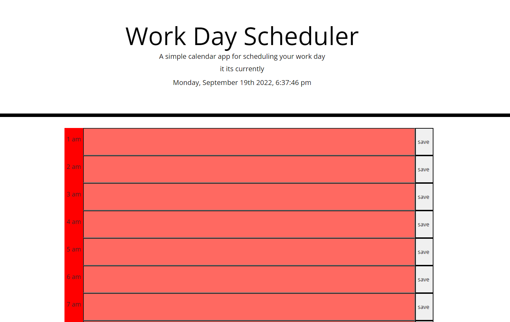
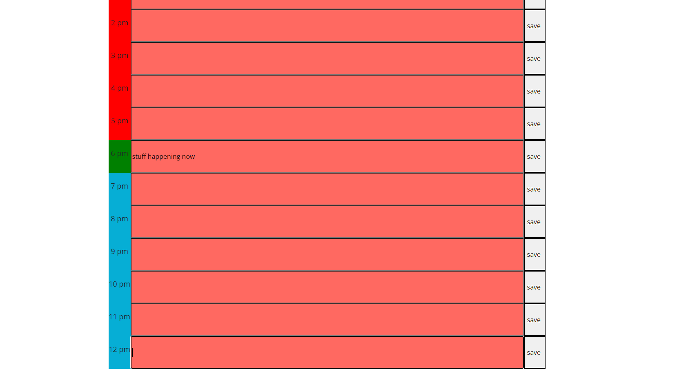

# shedules-stuff

## Description
this is a time schedule maker this website lets you add text to a corresponding time
to help you attach a task to a time

## Usage

type in the tasks into the corresponding hour and press the save button when the time comes around the tasks color will turn green and when it has passed it will turn red you can chack the top of the page to check what time it is

 
    
 
